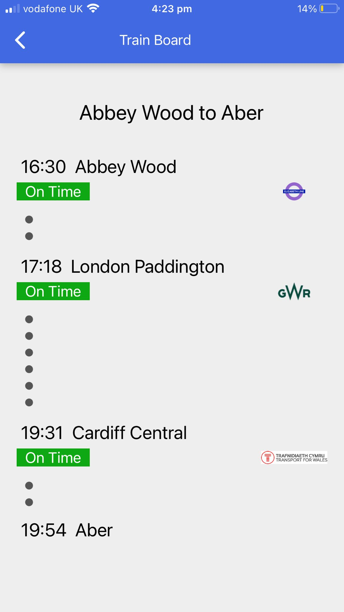
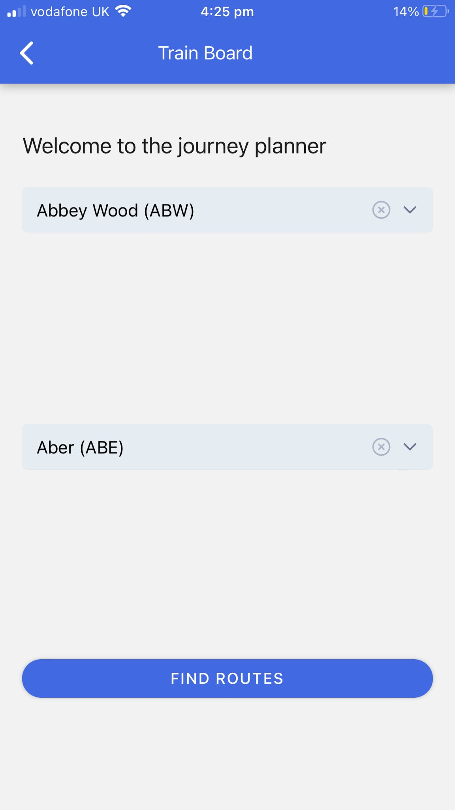
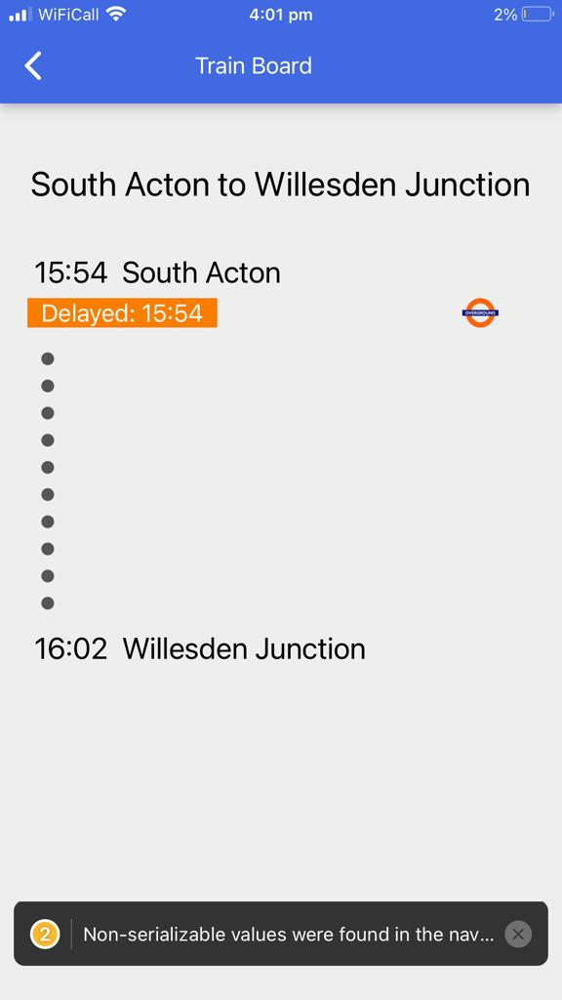
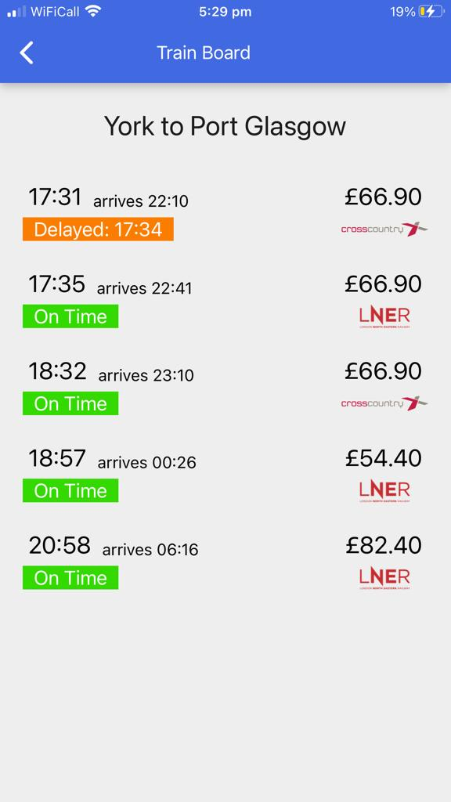

# Trainboard - Mobile App

Trainboard App for Softwire Training:
### Selling points of our version of the TrainBoard App:
- Searchable dropdown list / typeahead for station selection
- Error handling without displaying raw API errors to the user
- Live updating every 5 minutes on the journey details screen
- Logos of the train companies
- Live status updates for the trains (On Time etc)
- Cross Platform (iOS and Android)

### Further Features to add:
- Support for return journeys
- Entering railcards and the people that want to travel on the home screen
- Finding the nearest station to the user by GPS using Expo Location
- Caching the list of stations so that we don't have to download them eveyr time
- Fix the warning about the Date not being serializable
- State persistence so that when the user goes off the app and comes back on then the app state will be maintained

<br />






<br />

# Starter Instructions:

## Overview

This Trainboard App starter is a [React Native/Expo](https://expo.dev/) cross-platform mobile app which serves to support the Softwire React Native Trainboard training exercise.

## Developer Setup

### Setup

1. Install Node.js v16.13.0, NPM and NVM. There are instructions for how to do this on Windows (with and without WSL) [here](https://docs.microsoft.com/en-us/windows/dev-environment/javascript/nodejs-overview).
2. Install [VSCode](https://code.visualstudio.com/download) (or another preferred editor). VSCode is recommended unless you have a strong preference otherwise due to its good compatibility with typescript, excellent community extensions and for consistency across all developers when pairing.
3. Install the recommended VSCode extensions. These can be found in `.vscode/extensions.json`. VSCode should prompt you to install them. If not, open the extensions tab in the sidebar and select recommended extensions from the … dropdown.
4. Install the project dependencies with `npm install`.
5. Install the Expo CLI gloablly with `npm install -g expo-cli`.
6. Install the Expo Go app on your phone from the Play Store/App Store.
7. Run the code!
     - Run in development mode with hot reloading with `npm start`
     - If you have changed environment variables or otherwise want to clear the Expo cache, run `npm run start:clean`
     - To view the app on your own device, simply scan the QR code in the command line with the Expo Go app
     - Once loaded, making code changes in VS Code should hot-reload in the app
     - The npm commands are set up to run Expo in Tunnel mode. For more options, visit the localhost link given when you run the code in the browser and change the configuration in the browser-based developer tools.

### Running on a Simulator

#### Android

- Download [Android Studio](https://developer.android.com/studio)
- Install with the recommended settings
- Start up a simulator by selecting "Configure" and "AVD"
- Connect to the simulator using `npm run android`

#### iOS

Similar steps to Android can be used to run on iOS with `npm run ios`, but to run an iOS simulator you will unfortuantely need access to a Mac to use Xcode to generate the simulator.

We will do most iOS testing using the QR code method described above, but Cameron has a Mac if there's anything that you strictly need to test on a simulated iOS device.

## Linting

The code is linted using [ESLint](https://eslint.org/) with [Prettier](https://prettier.io/) for additional opinionated formatting of code style. You can check for linting issues with:

```shell
npm run lint
```

Or just run Prettier with:

```shell
npm run format
```

To fix all autofixable linting issues, run:

```shell
npm run lint:fix
```

Files do not autofix formatting on save or with git hooks. This is because I think it's useful to see what stylistic issues the linter has with your code rather than them just magically being fixed. This is for two reasons:
- It's a good way to learn.
- It means that any suboptimal linting rules are more likely to be noticed and challenged.

If anyone's interested to know about how you'd set up linting to fix itself on file save and/or commit, let me know!
